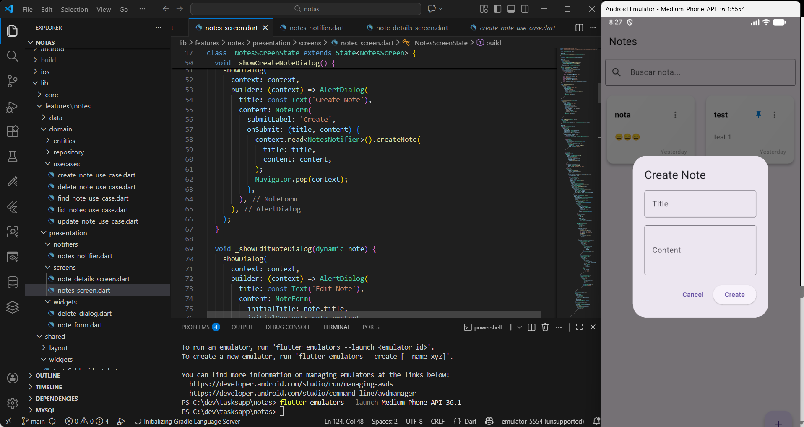
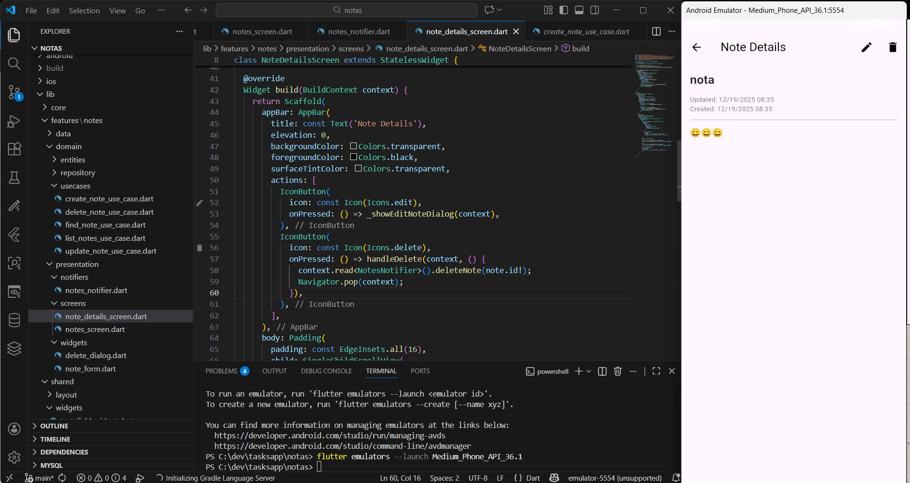

# Notas

Aplicación móvil desarrollada con [Flutter](https://flutter.dev/) para la gestión de notas. Permite crear, editar y eliminar notas.

## Instrucciones de compilación

1. Contar con flutter instalado,  [documentación oficial](https://flutter.dev/docs/get-started/install).
2. Haber clonado el repositorio.
3. Abrir una terminal en la carpeta raíz del proyecto.
4. Ejecutar el comando `flutter pub get` para instalar las dependencias.
5. Ejecutar el comando `flutter run` para compilar y ejecutar la aplicación.

### Build para producción

Para compilar la aplicación para producción, ejecutar el siguiente comando:

```bash
flutter build apk --release
```

## Capturas de pantalla




## Decisiones de diseño

- Se utilizó Flutter para permitir el desarrollo multiplataforma.
- Se optó por una interfaz sencilla y minimalista para facilitar la usabilidad.
- La aplicación almacena las notas localmente para garantizar la privacidad del usuario.
- A nivel de arquitectura, se utilizó el patrón MVVM para separar la lógica de negocio de la interfaz de usuario.
- Se implemento el paquete `provider` para la gestión del estado de la aplicación.
- Se utilizó SQLite como base de datos local para almacenar las notas de manera eficiente.
